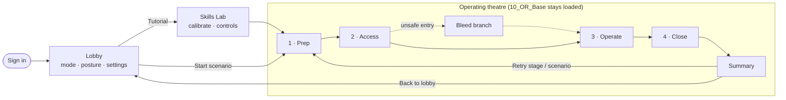
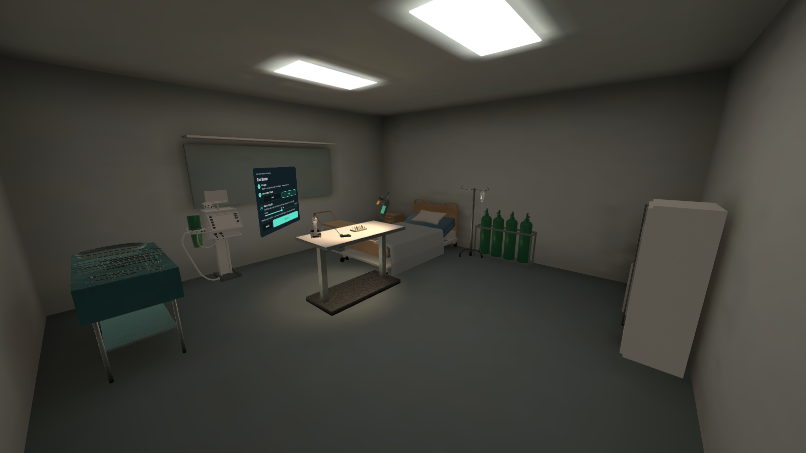
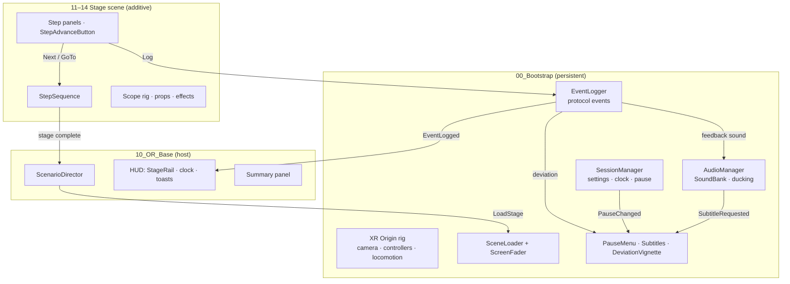
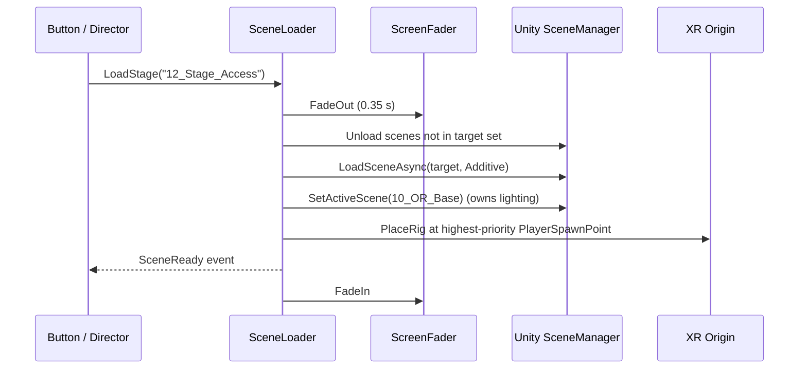
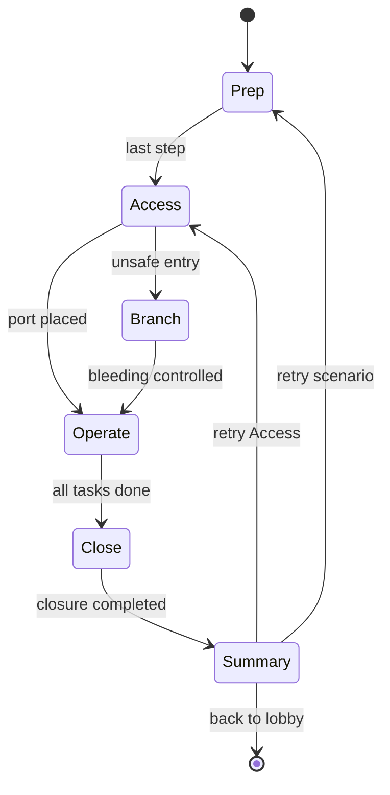

<div align="center">

# 🩺 Surgical Foundations VR: Technical guide

### Architecture, systems, content pipeline and conventions, for developers.

For what the project is and why it matters, see the [README](../README.md).

**One learner · one operating theatre · about 15 minutes**

Scrub in, gown and glove, mark and place your ports, operate through a 30° laparoscope and close,
with real-time protocol feedback, on-device scoring and a full session replay.


<sub>Access stage: trocar-entry gauges and technique flag, the laparoscope feed on the tower monitor, and the fenestrated drape shaped over the patient with the prepped port site in the window.</sub>

</div>

---

## 📑 Contents

1. [Overview](#-overview)
2. [The learning scenario](#-the-learning-scenario)
3. [Screenshots](#-screenshots)
4. [Getting started](#-getting-started)
5. [Controls](#-controls)
6. [Project structure](#-project-structure)
7. [Architecture](#-architecture)
8. [Systems in depth](#-systems-in-depth)
9. [Script reference](#-script-reference)
10. [Asset catalogue](#-asset-catalogue)
11. [UI screen catalogue](#-ui-screen-catalogue)
12. [Audio catalogue](#-audio-catalogue)
13. [Shader library](#-shader-library)
14. [Editor tooling & content pipeline](#-editor-tooling--content-pipeline)
15. [How-to recipes](#-how-to-recipes)
16. [Conventions](#-conventions)
17. [Performance on Quest](#-performance-on-quest)
18. [Testing & QA](#-testing--qa)
19. [Troubleshooting & FAQ](#-troubleshooting--faq)
20. [Roadmap & requirements](#-roadmap--requirements)
21. [Backend connection](#-backend-connection)
22. [Contributing & version control](#-contributing--version-control)
23. [Documentation index](#-documentation-index)
24. [Credits & licence](#-credits--licence)

---

## 🔭 Overview

Surgical Foundations VR teaches the core steps of a laparoscopic procedure in a fully simulated operating theatre. It is built for **medical students and junior trainees** who need safe, repeatable practice of sterile technique, port placement and basic laparoscopic handling before they meet a real patient.

| | |
|---|---|
| 🎯 **Audience** | Medical students, junior surgical trainees |
| 🥽 **Hardware** | Meta Quest 3 standalone · controllers or hand tracking |
| 🧭 **Modes** | **Guided**: highlights, voice prompts, live flags · **Assessment**: no cues, result sent to the LMS |
| 🪑 **Posture** | Standing or seated (table height is calibrated per learner) |
| 📊 **Outputs** | Overall and per-stage scores, top 3 issues to work on, protocol event log, session replay, xAPI / SCORM |
| 📶 **Connectivity** | Works fully offline; results queue on the headset and sync when it reconnects |

### Highlights

- **Complete procedure flow**: Prep → Access → Operate → Close → Summary, each stage loading on top of a persistent theatre.
- **Protocol feedback in three classes** (*on protocol · delayed · deviation*), with toasts, sounds and a coral edge flash for deviations.
- **A real laparoscope view**: a second camera inside the insufflated cavity renders to the tower monitor through a scope-lens shader.
- **Fulcrum-correct instruments**: every instrument has tip and port pivots and separate jaw meshes.
- **Design-faithful UI**: all 16 screens of the headset UI prototype rebuilt as world-space panels.
- **Baked, Quest-tuned lighting** with mixed surgical lights, dense probes and box-projected reflections.
- **Original audio**: 63 synthesised sounds plus placeholder voice prompts with subtitles.
- **20 custom URP shaders**: tissue, steel, drapes, gloves, blood, water, monitors and more.
- **Reproducible content**: one menu item regenerates every model, material, screen and scene.

### By the numbers

| Scenes | Prefabs | Materials | Sounds | Shaders | C# files | Lines of C# | Lines of HLSL |
|:-:|:-:|:-:|:-:|:-:|:-:|:-:|:-:|
| 10 | 79 | 104 | 63 | 20 | 62 | ≈ 8,350 | ≈ 1,750 |

> **Current state: playable grey-box.** All 41 models from the production asset list exist as real-scale placeholders (the nurse, anaesthetist, patient and scrub sink are already real models, and the rooms are dressed with imported ward equipment), all 16 UI screens are built, lighting is baked and the scenario runs end to end. The "Continue" buttons currently stand in for step detection; detection, scoring, the pose recorder and the backend come next (see the [roadmap](#-roadmap--requirements)).

---

## 🧑‍⚕️ The learning scenario



### Stage by stage

| Stage | What the learner does | Screens | Voice prompt | Events logged (examples) |
|---|---|---|---|---|
| **Sign-in** | Scan the QR code or enter the device code (or continue from an LMS launch) | 01 | — | — |
| **Lobby** | Choose Guided or Assessment, seated or standing, controllers or hands; subtitles; text size | 02 | *"Welcome back…"* | — |
| **Skills Lab** | Calibrate height, dominant hand and table height; learn the controls on a peg board | 03 · 04 | *"Stand or sit naturally…"* · *"Squeeze the trigger…"* | Calibration saved |
| **1 · Prep** | Surgical scrub at the sink (with a ghost-hand demo), gown and glove, sterility check at the back table, opening instrument count, drape | 05 · 06 · 07 | *"Keep your hands above your elbows…"* · *"Sterility broken…"* | Scrub complete · Glove touched non-sterile edge (**deviation**) · Sterile field confirmed |
| **2 · Access** | Mark three port sites, insert trocars watching angle, depth and force; optional unsafe-entry bleed branch | 08 · 09 · 10 | *"Mark the right working port…"* · *"Angle too shallow…"* | Port sites marked · Angle too shallow (**delayed**) · Vessel injury (**deviation**) |
| **3 · Operate** | Peg transfer, dissection, clip and cut through the laparoscope; camera assistant; drift warning | 11 · 12 | *"Bring your left instrument back into view…"* | Ring transferred · Drift corrected (**delayed**) |
| **4 · Close** | Instrument and swab count (one swab is hidden), remove ports under vision, camera port last | 14 · 15 | *"Closure blocked…"* · *"Watch the port site…"* | Swab located · Closure completed |
| **Summary** | Overall score, stage bars against pass marks, top 3 issues, retry | 16 | *"Closure completed…"* | — |
| **Pause** (any time) | World dims, timer freezes; resume, recalibrate, restart or end | 13 | — | Pause logged |

Stages load **additively** on top of `10_OR_Base`, so the room, its baked lighting and the patient never reload. Every scene change is a fade to black. Nothing ever moves the learner's camera (comfort requirement NFR-05). Inside a stage the learner can also be moved between work areas (sink → back table) under a quick fade.

---

## 🖼 Screenshots

| Operating theatre: baked lighting, IV stand, oxygen, cabinets, equipment cart | Skills lab: calibration table and ward bay |
|---|---|
|  |  |
| **Prep: three-tap scrub sink, running tap, ghost-hand demo** | **Lobby: sign-in panel and waiting area** |
|  |  |


<sub>Imported and textured models: nurse, anaesthetist, patient on the OR table, scrub sink, hospital bed, IV stand, oxygen cylinders, heart-lung machine, equipment cart, patient monitor, bedside cabinet and visitor chair.</sub>

Regenerate these images with **Surgical Foundations ▸ Tools ▸ Render README Screenshots** (bake lighting first).

<details>
<summary><b>UI screens</b> (rendered straight from the prefabs; click to expand)</summary>

| | | |
|---|---|---|
| **01 Sign-in**  | **02 Lobby**  | **03 Calibrate**  |
| **04 Tutorial**  | **05 Scrub**  | **06 Sterility**  |
| **07 Tray & drape**  | **08 Port sites**  | **09 Trocar entry**  |
| **10 Bleed branch**  | **11 Operate**  | **12 Drift**  |
| **13 Pause**  | **14 Count**  | **15 Port removal**  |
| **16 Summary**  | **HUD**  | **Subtitles**  |

</details>

<details>
<summary><b>Shader gallery</b> (all 20 custom shaders)</summary>


</details>

---

## 🚀 Getting started

### Prerequisites

| Requirement | Notes |
|---|---|
| **Unity 6000.6.3f1** | Install through Unity Hub with **Android Build Support** (OpenJDK, Android SDK & NDK) |
| **Meta Quest 3** | Developer mode enabled, USB-C cable (or Air Link for PC testing) |
| **Git** | No Git LFS needed: no single asset is larger than 20 MB |
| *Optional* | Rider or Visual Studio (both IDE packages are included) |

All Unity packages (URP, XR Interaction Toolkit, XR Hands, OpenXR, Meta OpenXR, Input System, TextMesh Pro) are declared in `Packages/manifest.json` and install automatically on first open.

### First run

```bash
git clone https://github.com/DUSHIME1212/Surgical-Foundations-VR.git
```

1. Add the cloned folder in **Unity Hub** and open it with **6000.6.3f1**. The first import takes a few minutes.
2. Open **`Assets/_Project/Scenes/Core/00_Bootstrap.unity`**.
3. Press **Play**. You start in the lobby.

> 💡 **You can press Play in any project scene.** `AppBootstrap` pulls in `00_Bootstrap` (XR rig, audio, services) automatically. If you open a stage scene, the theatre is loaded around it too, which is handy when iterating on a single stage.

### Testing without a headset

- The **XR Interaction Simulator** (XR Interaction Toolkit sample, already imported) drives the rig with mouse and keyboard, including simulated controllers and tracked hands. It spawns automatically when you press Play in the editor; its on-screen panel lists the controls.
- Switch what drives Play mode with **Surgical Foundations ▸ Play Mode**:
  - **XR Simulator (no headset)**: the simulator runs and OpenXR stays off on PC, so a Link/SteamVR runtime can't take over.
  - **Headset via Link**: OpenXR starts on PC for Quest Link / Air Link and the simulator is not spawned.
  - Only the PC settings change; the Android (Quest) build is unaffected.
- **Esc** opens the pause menu.
- Every UI screen can be reviewed as a PNG via **Surgical Foundations ▸ Tools ▸ Render UI Previews**.

### Building to Quest

1. **File ▸ Build Profiles ▸ Android** → *Switch Platform*.
2. The scene list is already configured: `00`–`14` are enabled, `90_ReplayViewer` is listed but disabled.
3. Plug in the headset → **Build And Run**.

### Building the replay viewer

`90_ReplayViewer` is a separate desktop/WebGL build without the XR rig. It has its own camera, event system and screen-space controls. Create a Windows or WebGL build profile containing only that scene.

---

## 🎮 Controls

| Action | Quest controllers | Hand tracking | Desk / editor |
|---|---|---|---|
| Point at and press UI | Ray + **Trigger** | Pinch | Simulator |
| Grab an instrument | **Grip** | Grab | Simulator |
| Close jaws / fire clip | **Trigger** (while held) | Pinch (planned) | — |
| Rotate tip / zoom camera | **Thumbstick** | — | — |
| Pause | Left **Menu** button | Menu gesture | **Esc** |
| Move | Thumbstick move / teleport | Teleport gesture | Simulator |

Assessment mode defaults to controllers for precise scoring.

---

## 🗂 Project structure

Everything the team owns lives in **`Assets/_Project/`** (the underscore sorts it first). Template and sample content stays where Unity and Package Manager put it (`VRTemplateAssets`, `Samples`, `XR`, `XRI`, `TextMesh Pro`). Personal experiments go in `Assets/_Sandbox/`.

```
Assets/_Project/
├── Art/
│   ├── Materials/        per category + Imported/ (generated by MaterialLibrary / ImportedAssets)
│   ├── Models/           real FBX files replacing placeholders go here
│   ├── Shaders/          20 SF shaders + Include/ (SFCommon.hlsl, SFPasses.hlsl)
│   └── Textures/  VFX/
├── Animation/            Characters · Hands · Instruments · Controllers
├── Audio/
│   ├── Ambience/         AMB_*_Loop.wav
│   ├── SFX/              UI · Feedback · Instruments · Environment
│   └── Voice/            VO_<Stage>_<Line>.wav
├── Data/                 SoundBank · UITheme · TMP_Icons
├── Imports/              third-party models as downloaded
├── Lighting/             LightingSettings · VolumeProfiles
├── Prefabs/              Environment · Equipment · Instruments · PPE · Anatomy ·
│                         TrainingProps · Characters · UI/Screens · UI/HUD
├── Scenes/               Core · Frontend · Theatre · Tools
├── Scripts/
│   ├── Runtime/          SurgicalFoundations.Runtime.asmdef
│   └── Editor/           SurgicalFoundations.Editor.asmdef (Builders/, Tools/)
└── UI/                   Sprites · Icons · Fonts
Docs/                     plans, guides, UI previews, screenshots
```

### Scenes

| Scene | Folder | Loaded | Contents |
|---|---|---|---|
| `00_Bootstrap` | Core | Always | XR rig, EventSystem, SessionManager, SceneLoader + ScreenFader, EventLogger, AudioManager, pause menu, subtitles, deviation vignette |
| `01_Lobby` | Frontend | Single | Octagonal lobby, sign-in → lobby panels, ambient pad |
| `02_SkillsLab` | Frontend | Single | Training table, peg board, controller diagram, microscope, open surgery set, calibrate → tutorial |
| `10_OR_Base` | Theatre | Single, then host | Theatre + scrub alcove, table, patient, drape, cavity, surgical lights, tower, anaesthesia machine, patient monitor, heart-lung machine, HUD, summary, `ScenarioDirector` |
| `11_Stage_Prep` | Theatre | Additive | Scrub sink, ghost-hand demo, gown, scrub nurse, gloves, instrument tray (8 items), swabs |
| `12_Stage_Access` | Theatre | Additive | Abdominal wall layers, port markers, epigastric vessels, Mayo instruments, scope rig, bleed pool |
| `13_Stage_Operate` | Theatre | Additive | Trocars, inserted instruments, peg board / tissue / clip-and-cut in the cavity, scope rig |
| `14_Stage_Close` | Theatre | Additive | Kick bucket, swabs (one hidden), needle holder, trocars, scope rig |
| `90_ReplayViewer` | Tools | Separate build | Stripped theatre, learner ghost (hologram), free camera, replay controls |
| `91_ShaderGallery` | Tools | Not in build | All 20 shaders on pedestals |

### Assemblies

| Assembly | Platforms | References |
|---|---|---|
| `SurgicalFoundations.Runtime` | All | TextMeshPro, uGUI, Input System, XRI, XR Core Utils, URP Core & Runtime |
| `SurgicalFoundations.Editor` | Editor | Runtime + the above |

---

## 🏛 Architecture

### Runtime composition



### Scene-change lifecycle



### Scenario and event model



Every protocol event is a `ProtocolEvent { id (client UUID), sessionTime, stage, eventClass, code, message }`. The client-generated id is what will make offline re-syncs idempotent (FR-25).

| Event class | Toast colour | Sound | Extra |
|---|---|---|---|
| On protocol | Mint | `FB_OnProtocol` chime | — |
| Delayed | Amber | `FB_Delayed` double tone | — |
| Deviation | Coral | `FB_Deviation` descending tone | Coral edge-vignette flash |
| Info | — | — | Stage transitions, not shown to the learner |

Toasts, sounds and the vignette appear only in **Guided** mode. In **Assessment** mode, events are still logged silently.

### Step detection

Events come from what the learner does, not from buttons. Each stage scene gets a controller when it loads (`DetectionInstaller`, no scene wiring), and each controller is a thin sensor around a plain C# rule class that can be unit-tested without a headset.

| Stage | Controller | Rule class | What is measured | Stage moves on when |
|---|---|---|---|---|
| Prep | `PrepController` | `ScrubSequence` | Where both hands are (under the tap, at the towels, in front of the eyes), whether they are together and rubbing, fingertips up | All six scrub steps are held for their time, in order |
| Prep | `PrepController` | `TrayCheck` | The item nearest the hand's pointing ray when the trigger is pulled, for every instrument and swab on the back table | n/a: the learner confirms the sterile field; lines left unchecked are deviations |
| Theatre (all stages) | `SterilityMonitor` | `SterilityState` | Gloved hands against `NonSterileEdge…` colliders, and hands held below table level | n/a: a break is logged, recovery is taking a fresh glove packet |
| Access | `AccessController` | `PortSitePlan` | Where the pointing ray meets the skin when the trigger is pulled, against each landmark target | All three marks are within the target radius |
| Access | `AccessController` | `TrocarEntry` | Tip depth below the skin, angle off the entry axis, push speed as a stand-in for force | Each trocar is held in the safe depth window, on axis, for 1 s. Too deep jumps to the bleed branch |
| Access | `AccessController` | `BleedControl` | After an unsafe entry: trocar depth (drawn back), a hand on the site (pressure, held 5 s), head direction with the hand off (watching, 3 s) | The bleed is controlled: entry carries on with the next port |
| Operate | `OperateController` | `DriftMonitor` | Each inserted instrument tip in the laparoscope camera's viewport | n/a: drift is logged, the drift panel shows until the tip is back in view |
| Operate | `OperateTasks` | `PegTransfer` | Jaws closing on a ring, and where the ring is when they open | All six rings are on the far row of pegs |
| Operate | `OperateTasks` | `Dissection` | The dissector's jaws spreading at each point of the plane; tip speed inside the tissue | All five points are opened |
| Operate | `OperateTasks` | `ClipAndCut` | The clip applier closing at each clip site, the scissors closing at the cut point | The structure is cut (unclipped = deviation). Last task: ends Operate |
| Close | `CloseController` | `SwabCount` | Swabs released inside the kick bucket; one swab is hidden at a seeded spot | Counted swabs equal the opening count |
| Close | `CloseController` | `PortRemoval` | Each port lifted 6 cm from where it sat, and whether its site was on the monitor at that moment | n/a: blind removal, or the camera port before the others, is a deviation |
| Close | `CloseController` | `PortClosure` | The needle holder closing at each side of a removed port's site | Every port is out and every site has its stitch: ends the scenario |

**Why it is built this way**

- **Rules separate from sensors.** `ScrubSequence`, `TrocarEntry` and the rest take numbers and booleans, so the tests in `DetectionLogicTests` and `TaskLogicTests` run in milliseconds and an SME change to a rule is a one-file edit.
- **Small props are placed, not simulated.** A 2 cm ring on a 6 mm peg, a clip, a stitch: at that size the physics engine is unreliable on a headset, and a ring that jitters off its peg would be scored as the learner's mistake. The jaws pick a ring up, carry it, and it snaps to the peg it is released over.
- **Tissue force is measured by tip speed for now.** Until soft tissue (FR-14) reports real strain, an instrument moved fast while inside the tissue volume is logged as excess force. The threshold is in the scoring config.
- **Thresholds come from the scoring config** (`ThresholdKeys`), with built-in fallbacks. The values that decide a deviation are versioned with the scores they produce (FR-18).
- **Event codes are shared with the server** (`EventCodes` in the Contracts package), so a code can't be spelled one way in the headset and another in the scoring config.
- **Every panel keeps a skip button** ("Skip the rest of the scrub", "Close anyway"). Skipping logs what was left undone as deviations, so a learner is never stuck and never gets a free pass. Closing with a swab unaccounted for is the one critical event that fails the run.
- **A dropped hand is one break, not a stream of them.** Hands below table level are non-sterile, but the hand has to come back up before dropping it can be logged again, and a controller that isn't being tracked is ignored.
- **Guided vs Assessment.** Detection and logging are identical in both. Guided adds the help: landmark rings, on/off-target read-outs, the technique flag, the recovery card and the coaching voice lines.

All detection limits are placeholders until the SME signs them off.

### Guided mode

Guided and Assessment run the same detection and log the same events. Guided adds coaching on top; Assessment removes all of it (FR-19).

| Aid | Where it comes from | What it does |
|---|---|---|
| Highlight | `GuidedHighlight` + each controller's `GuideTarget` | One pulsing marker on whatever the step needs next: the tap, the towels, the glove packet, the next port site, the ring to pick up, then the peg to put it on, the instrument to fetch from the Mayo stand, then the free port to pass it through. It moves the moment detection sees the step done, and it shows on the laparoscope monitor for targets inside the abdomen. |
| Scrub nurse | `ScrubNurse` | Turns to face the learner and says one short line for events worth a word ("That was cut before it was clipped", "The camera port comes out last"). Lines are subtitles until the voice-over is recorded. |
| Coaching voice | `DetectionLog` | The recorded lines for a sterility break and a shallow trocar angle play when the event happens. |
| Read-outs | Stage panels | On/off-target distances, the technique flag, the recovery card, live task metrics, landmark rings and stitch points. |

**Why it is built this way**

- **One target, not many.** A beginner who is shown everything at once looks at nothing. The highlight answers a single question: what next?
- **The hidden swab is never highlighted.** Finding it is the exercise.
- **The controller decides the target, the highlight only draws it.** Each stage already knows what it is waiting for, so guidance can't drift out of step with detection.
- **The nurse reads the event log.** She needs no wiring to the stages: any event code with a line gets said, and adding a line is one dictionary entry.

### Instruments through ports

Keyhole instruments are not held like ordinary objects: the shaft passes through a port in the abdominal wall, so the hand can only pivot it about that point, slide it in and out, and roll it. Moving the hand left swings the tip right (FR-10).

| Piece | What it does |
|---|---|
| `InstrumentPort` | Added at runtime to every `Trocar_*`. Knows its fulcrum (on the skin), its valve (where instruments go in) and which instrument is in it. One instrument per port. |
| `LapInstrument` | Added at runtime to every instrument with a shaft. Free in the hand outside the patient; fulcrum-constrained once the tip enters a valve; free again when pulled right out. Let go outside a port, it returns to the Mayo stand. |
| `FulcrumSolver` | The geometry, as plain maths: from the hand position and roll it returns the pose whose shaft passes exactly through the port, within the shaft's travel. |
| `InstrumentJaws` | Jaws follow the trigger (or pinch) continuously, 0–1, with one click as they shut and one as they open. |

**Why it is built this way**

- **Position comes from the port, not from physics joints.** A configurable joint through a moving hand jitters at Quest frame rates. Solving the pose directly is stable, costs nothing, and is exact: the shaft never leaves the port.
- **The scenes were not rebuilt.** Ports and instruments get their behaviour when a stage loads (`InstrumentInstaller`), so the baked lighting is untouched.
- **Instrument exchange is the same mechanism.** Pull an instrument out past the valve and it is free; put another one's tip to the valve and it is constrained. The scope can't be withdrawn: taking the camera out blinds the team.
- **The laparoscope camera rides on the scope**, so moving the scope moves the picture on the monitor.
- **Wrist roll rolls the shaft.** The thumbstick is left alone because it belongs to turning and teleporting.

### Camera assistant

In Operate the laparoscope is held by a camera assistant (`CameraAssistant`), so both of the learner's hands are free for instruments. The chips under the monitor (`CameraAssistantBar`) ask for the view to be moved: pan left, right, up, down, zoom in, zoom out. Each chip moves the target by one step (8° or 2 cm, `CameraAim`) and the scope glides there about its port. **Hold myself** hands the scope to the learner, who then steers it by hand through the port; the command chips go dim until the assistant has it back.

**Why it is built this way**

- **The assistant holds by default.** The tasks need two instruments; a learner holding the camera has one hand left.
- **Left and up mean left and up on the monitor.** The pan axes are taken from the camera's view, not from the scope, whose roll depends on how it sits in the port.
- **Zoom is the scope moving in and out**, as it is in theatre, not a change of lens.
- **Every command is logged** (`operate.camera.command`, no penalty). How often a trainee has to ask for the camera is a measure of how well they plan their view, and it is there for the educator in the replay.
- **The chips are buttons for now.** The design shows them as spoken commands; speech recognition is not built.
- **Close has no assistant.** There the learner steers the scope by hand, because aiming it at each port site is part of removing ports under vision.

---

## ⚙ Systems in depth

<details open>
<summary><b>Scene loading & bootstrap</b></summary>

- `SceneLoader` is the only thing that changes scenes. **Frontend** scenes (Lobby, Skills Lab) replace each other. **Stages** load additively on top of `10_OR_Base`, which stays the *active* scene so its baked lighting, ambient and reflection settings apply to every stage.
- `PlayerSpawnPoint` marks where the learner stands (blue axis = facing). The loader moves the XR origin with `MatchOriginUpCameraForward` + `MoveCameraToWorldLocation` while the screen is black.
- `TeleportTo(transform)` does a short fade-move-fade inside a stage (e.g. scrub sink → back table in Prep).
- `AppBootstrap` uses `RuntimeInitializeOnLoadMethod(BeforeSceneLoad)` to add `00_Bootstrap` when Play starts in another project scene, and adds `10_OR_Base` when that scene is a stage.

</details>

<details>
<summary><b>Session, pause & comfort</b></summary>

- `SessionManager` holds settings (mode, posture, input, subtitles, text scale, dominant hand, table height), the session clock (unscaled time), the random seed, and pause.
- Pausing sets `Time.timeScale = 0` and `AudioListener.pause = true`. UI and feedback sounds ignore listener pause so the menu still clicks.
- `PauseMenu` binds its own input action (left-controller menu button + Esc), places the pause card 1.1 m in front of the learner and shows a head-locked dimmer sphere (shader 19).
- No animation moves the camera. Every relocation happens under a fade.

</details>

<details>
<summary><b>UI system</b></summary>

- Built with **world-space uGUI + TextMeshPro** at 1 canvas pixel = 1 mm, positioned ~1.4–1.9 m from the learner.
- **Design tokens** live in `Data/UI/UITheme.asset`: panel `#0F1D20`, border `#2A4145`, mint `#5CE0C8`, coral `#FF8A79`, amber `#F5B54B`, text `#E8F0EF` / `#A7B8B7` / `#7C9191`.
- 9-slice sprites (rounded panels, cards, pills, rings) and icons are generated PNGs in `UI/Sprites` and `UI/Icons`. Import borders are applied automatically by `AssetImportRules`.
- Components: `UIPanel` (open/close scale + fade, 200 ms), `UIButtonFeedback` (hover lift, press squash, sound, controller haptic tick), `SegmentedOption` (toggle cards), `StageRail`, `SessionHudBinder`, `EventToastPresenter`, `SubtitlePresenter`, `UIMotion` (score count-up and bar fill), `StepSequence` / `StepAdvanceButton` (stage flow), `UIActions` (scene-local bridge to services in other scenes).
- The HUD and subtitles follow the head with XRI's `LazyFollow`. Stage panels sit in the room next to the task they describe.
- The default font lacks ✓, so ticks use a TMP sprite asset (`Data/UI/TMP_Icons.asset`, `<sprite name="check" tint=1>`).

</details>

<details>
<summary><b>Audio</b></summary>

- `AudioManager` plays everything by `SoundId`. It has a pool of 24 one-shot sources, a dedicated voice source and looping emitters with fade in/out.
- Five categories with their own volume: **UI · Feedback · SFX · Ambience · Voice**. Ambience ducks to 45 % while a voice line plays.
- Voice lines carry their subtitle text in the `SoundBank`; playing one raises `SubtitleRequested`, and the subtitle bar shows it if subtitles are on.
- `AmbientEmitter` (room tone, monitor beep, insufflator, tap water, light hum), `ImpactSound` (speed-scaled collisions) and `GrabSound` / `InstrumentJaws` (pickup, jaw clicks) cover world sounds.
- Import rules: one-shots → ADPCM, decompress on load; loops and voice → Vorbis, compressed in memory; everything mono.

</details>

<details>
<summary><b>Lighting & rendering</b></summary>

- **Rooms are fully baked** with the GPU lightmapper in *Baked Indirect* mode: rectangle area lights over the ceiling panels, emissive panels, AO and 3 bounces. Lightmaps are non-directional, 1024² max, which halves lightmap memory on Quest.
- **Surgical light heads** are *Mixed* spots (4500 K). They give real-time specular on steel and one soft shadow over the operative field; only head A casts shadows to bound cost.
- **Light probes** use a 1 m grid across the room plus a dense 0.35 m block around the table, so moving instruments, hands and characters get correct bounce light.
- **Reflection probes** are box-projected: one for the room, a high-priority one at the table for instrument reflections, and one for the alcove.
- **Post-processing:** neutral tone mapping + grading profiles (Theatre / Lobby / Lab). On for PC and editor, off on Quest by default (`PlatformPostProcessing`).
- **URP settings** applied by the builder: per-pixel additional lights (limit 4), additional-light shadows (1024 atlas), reflection-probe blending and box projection, linear intensity, colour temperature.
- **Laparoscope:** a mono camera inside the cavity with its own 5600 K scope light renders to a 960×540 RenderTexture, shown through the *Laparoscope Screen* shader. `renderEveryNthFrame` trades smoothness for cost.

</details>

<details>
<summary><b>Instruments & interaction</b></summary>

- Built on the **XR Interaction Toolkit 3.6** rig from the VR template: near/far interactors, teleport, continuous move and snap turn.
- Every instrument prefab is an `XRGrabInteractable` with a rigidbody, a fitted collider, an `Attach` point at the handle, and named pivots `Pivot_Tip` and `Pivot_Port` (fulcrum, FR-10).
- `InstrumentJaws` opens and closes the `Jaw_Upper` / `Jaw_Lower` hinges on activate/deactivate (trigger), with metallic click sounds. Analogue trigger control is next.
- Props placed "in use" (trocars in ports, instruments on trays) are kinematic in their scenes for stability.
- `EyeGazeActivator` keeps the template's gaze interactor off unless an eye-tracking device is present (Quest Pro yes, Quest 3 no). This avoids a startup warning without losing eye gaze where it exists.

</details>

---

## 📚 Script reference

### Runtime (`Assets/_Project/Scripts/Runtime`)

| Area | Script | Purpose |
|---|---|---|
| **Core** | `AppBootstrap` | Entry point; makes every project scene playable on its own |
| | `SceneLoader` | Fade → unload/load → set active scene → place rig → fade in; in-stage teleport |
| | `ScreenFader` | Screen-space-camera black canvas for fades |
| | `SessionManager` | Settings, clock, seed, pause |
| | `PlayerSpawnPoint` | Where the learner stands after a load (gizmo in Scene view) |
| | `SceneIds` | Scene-name constants |
| **Scenario** | `ScenarioDirector` | Stage sequencing, summary, retry, back to lobby |
| | `EventLogger` | Protocol event log, feedback sounds, `EventLogged` event |
| | `ProtocolEvent` | Event data + `ScenarioStage` / `EventClass` enums |
| **Audio** | `AudioManager` | Pooled playback, categories, ducking, loops, voice + subtitles |
| | `SoundBank` / `SoundId` | Data table and enum of every sound |
| | `AmbientEmitter` · `ImpactSound` | Looping emitters; collision sounds |
| **Interaction** | `LapInstrument` · `InstrumentPort` · `FulcrumSolver` · `InstrumentInstaller` | Fulcrum-constrained instruments through ports, instrument exchange (FR-10) |
| | `InstrumentJaws` · `GrabSound` · `EyeGazeActivator` | Analogue jaws + sounds; pickup sounds; conditional eye gaze |
| **Lighting** | `SurgicalLight` · `LaparoscopeFeed` · `PlatformPostProcessing` | Light-head control with emissive lens; scope RT feed; post on/off per platform |
| **Rendering** | `ShaderPropertyAnimator` · `SimpleMotion` · `DisableOnMobileXR` | Animate shader floats; demo motion; drop heavy FX on Quest |
| **Placeholders** | `PlaceholderInfo` | Asset-list metadata and "is placeholder" flag on every prefab |
| **UI** | `UITheme` · `UIPanel` · `UIButtonFeedback` · `SegmentedOption` | Tokens, panel tweens, button feel, toggle cards |
| | `StageRail` · `SessionHudBinder` · `EventToastPresenter` · `SubtitlePresenter` | HUD widgets |
| | `StepSequence` · `StepAdvanceButton` · `SkipStepButton` | Stage step flow; skip logs what was left undone |
| | `ScrubPanelBinder` · `SterilityPanelBinder` · `PortSitesPanelBinder` · `TrocarPanelBinder` · `CountPanelBinder` · `ChecklistRow` | Stage panels showing live detection state |
| **Detection** | `PrepController` · `AccessController` · `OperateController` · `CloseController` · `SterilityMonitor` | Per-stage sensors that feed the rules and advance the stage |
| | `OperateTasks` · `CameraAssistant` · `GuidedHighlight` · `ScrubNurse` | Operate task sensors; camera assistant; Guided-mode highlight and nurse reactions |
| | `ScrubSequence` · `SterilityState` · `PortSitePlan` · `TrocarEntry` · `DriftMonitor` · `SwabCount` | The rules themselves (plain C#, unit-tested) |
| | `PauseMenu` · `DeviationVignette` · `UIMotion` · `UIActions` | Pause, deviation flash, summary animation, button bridge |

### Editor (`Assets/_Project/Scripts/Editor`)

| Script | Purpose |
|---|---|
| `ProjectBuilder` | **Build Everything**, lighting bakes, placeholder report |
| `PlaceholderFactory.*` | The 41 asset-list prefabs + imported props (Environment · Instruments · Body · Imported partials) |
| `PB` | Small prefab-building DSL (primitives, pivots, colliders, grabbables, static flags) |
| `MaterialLibrary` | Every generated material, including the 20-shader assignments |
| `ImportedAssets` | Texture settings, PBR materials and material maps for `Imports/` |
| `UIKit` · `UIScreensBuilder` | UI component kit; the 16 screens, HUD, overlays |
| `SoundBankBuilder` | Maps clips to `SoundId` by file name, with subtitles |
| `LightingRig` | URP settings, lighting-settings assets, volume profiles, room light rigs |
| `SceneBuilder` | Assembles all 10 scenes and the build list |
| `AssetImportRules` | Sprite 9-slice borders, audio compression by folder |
| `UIPreviewRenderer` | Renders every UI prefab to `Docs/UI Previews` |
| `Ser` · `SFPaths` | Serialized-field setter; path constants |

---

## 🧱 Asset catalogue

The 41 models from the production asset list (38 MVP, 3 R2) plus 15 imported extras. **Tris** = LOD0 budget for Quest 3.

<details open>
<summary><b>Environment & equipment</b></summary>

| ID | Prefab | Tris | Release | Notes |
|---|---|:-:|:-:|---|
| ENV-01 | `ENV_OperatingTheatre` | 30k | MVP | 7 × 3 × 7 m, laminar canopy, door + window to the alcove |
| ENV-02 | `ENV_ScrubAlcove` | 10k | MVP | Attached behind the south wall |
| ENV-03 | `ENV_Lobby` | 15k | MVP | Octagonal, grid floor, mint cove light |
| ENV-04 | `ENV_SkillsLab` | 12k | MVP | Height-adjustable training table |
| EQ-01 | `EQ_ORTable` | 8k | MVP | Separate `TableTop` for calibration |
| EQ-02 | `EQ_SurgicalLights` | 6k | MVP | Two heads, mixed spots, emissive lenses |
| EQ-03 | `EQ_LapTower` | 6k | MVP | `LapTower_Screen` receives the scope feed |
| EQ-04 | `EQ_AnaesthesiaMachine` | 6k | MVP | Vitals screen, 72 bpm monitor beep |
| EQ-05 | `EQ_ScrubSink` | 17k | MVP | ✅ **Real model** (glTF): 3 sensor taps, water sockets at the spouts, soap lather |
| EQ-06 | `EQ_BackTable` | 3k | MVP | Sterile-zone + non-sterile-edge triggers |
| EQ-07 | `EQ_MayoStand` | 2k | MVP | Instrument sockets |
| EQ-08 | `EQ_InstrumentTray` | 2k | MVP | One named socket per counted item |
| EQ-09 | `EQ_KickBucket` | 1k | MVP | Swab drop target |

</details>

<details>
<summary><b>Instruments</b></summary>

| ID | Prefab | Tris | Notes |
|---|---|:-:|---|
| INST-01 | `INST_Trocar12` | 3k | Cannula + removable obturator, valve cap |
| INST-02 | `INST_Trocar5` | 3k | Same rig as 12 mm |
| INST-03 | `INST_Laparoscope30` | 4k | `CameraSocket` at the tip, 30° offset |
| INST-04 | `INST_AtraumaticGrasper` | 4k | Separate jaws, ratchet |
| INST-05 | `INST_MarylandDissector` | 4k | Curved jaws |
| INST-06 | `INST_LapScissors` | 4k | Separate blades |
| INST-07 | `INST_ClipApplier` | 4k | Loaded clip |
| INST-08 | `INST_SurgicalClip` | 0.2k | Instanced |
| INST-09 | `INST_Scalpel` | 1k | Port-site incision |
| INST-10 | `INST_NeedleHolder` | 3k | Needle + suture |
| INST-11 | `INST_Swab` | 1k | Hideable for the count |

</details>

<details>
<summary><b>PPE, anatomy, training props & characters</b></summary>

| ID | Prefab | Tris | Release | Notes |
|---|---|:-:|:-:|---|
| PPE-01 | `PPE_SurgeonHands` | 10k | MVP | Also used for the ghost-hand demo |
| PPE-02 | `PPE_SurgicalGown` | 8k | MVP | On a stand in the alcove |
| PPE-03 | `PPE_GlovesPacket` | 3k | MVP | Opening flaps |
| PPE-04 | `PPE_DrapeSet` | 4k | MVP | Fenestrated over the umbilicus, shaped over the patient's body |
| ANA-01 | `ANA_PatientBody` | 31k | MVP | ✅ **Real model**, supine, navel on the `Umbilicus` pivot, prepped-skin patch |
| ANA-02 | `ANA_AbdominalWallLayers` | 8k | MVP | Skin · fat · fascia · peritoneum, each with a trigger |
| ANA-03 | `ANA_AbdominalCavity` | 40k | MVP | Insufflated interior, only seen through the scope |
| ANA-04 | `ANA_DissectionTissue` | 10k | MVP | Obi Softbody target, collision proxy |
| ANA-05 | `ANA_ClipCutStructure` | 3k | MVP | Clip and cut points |
| ANA-06 | `ANA_EpigastricVessels` | 3k | R2 | Bleed socket |
| PROP-01 | `PROP_PegBoard` | 3k | MVP | 12 pegs, 6 rigid-body rings |
| PROP-02 | `PROP_TransferObjects` | 1k | MVP | Beads and blocks |
| PROP-03 | `PROP_PortSiteMarkers` | 0.5k | MVP | Dashed rings + target pulses |
| PROP-04 | `PROP_ControllerDiagram` | 2k | MVP | Neutral controller for the tutorial |
| CHR-01 | `CHR_ScrubNurse` | 20k | MVP | ✅ **Real model** (Mixamo rig), posed with sterile hands |
| CHR-02 | `CHR_Anaesthetist` | 15k | R2 | ✅ **Real model**, relaxed pose |
| CHR-03 | `CHR_CameraAssistantHands` | 6k | R2 | Holds the scope in R2 |

</details>

<details>
<summary><b>Imported extras</b> (background dressing, not in the asset list)</summary>

| Prefab | Tris | Where |
|---|:-:|---|
| `EQ_HeartLungMachine` | 17k | Theatre corner |
| `EQ_PatientMonitor` | 0.4k | Beside the anaesthesia machine, procedural vitals screen |
| `EQ_Microscope` | 11.6k | Skills lab table |
| `PROP_OpenSurgerySet` | ⚠ 165k | Skills lab only; decimate before wider use |
| `EQ_HospitalBed` · `EQ_BedsideCabinet` · `EQ_OverbedTable` | 5k · 0.4k · 1.4k | Skills-lab ward bay |
| `EQ_IVStand` · `EQ_OxygenCylinder` · `EQ_MedicalCart` | 3.4k · 3.7k · 3.3k | Theatre and ward bay |
| `EQ_SupplyCabinet` · `EQ_StorageCabinet` | 0.3k · 0.2k | Theatre walls and ward bay |
| `FURN_Sofa` · `FURN_VisitorChair` · `EQ_SideTable` | 2.3k · 1.5k · 0.1k | Lobby waiting area, skills lab |

The ward-room props are split out of one untextured FBX (`Imports/Hospital equi`) and textured with generated surfaces (fabric, vinyl, wood, laminate, powder coat) per part.

</details>

Run **Surgical Foundations ▸ Tools ▸ Placeholder Report** for a live list of what is still grey-boxed.

---

## 🖥 UI screen catalogue

| # | Prefab | Scene · step | Main actions |
|:-:|---|---|---|
| 01 | `UI_01_SignIn` | Lobby · 1 | Continue from LMS launch · Enter session code |
| 02 | `UI_02_Lobby` (3 panels) | Lobby · 2 | Mode · posture · input · subtitles · text size · Tutorial · Start scenario |
| 03 | `UI_03_Calibrate` | Skills Lab · 1 | Height · dominant hand · table height · Confirm |
| 04 | `UI_04_Tutorial` | Skills Lab · 2 | Control legend · fulcrum note · Next step |
| 05 | `UI_05_Scrub` | Prep · 1 | Scrub checklist · Continue to gown & glove |
| 06 | `UI_06_Sterility` (2 panels) | Prep · 2 | Deviation card · recovery steps · sterility status |
| 07 | `UI_07_TrayAndDrape` (2 panels) | Prep · 3 | Opening count · Confirm sterile field |
| 08 | `UI_08_PortSites` | Access · 1 | Port status · Begin trocar entry |
| 09 | `UI_09_TrocarEntry` (2 panels) | Access · 2 | Angle / depth / force gauges · technique flag · branch |
| 10 | `UI_10_BleedBranch` | Access · branch | Bleed management checklist |
| 11 | `UI_11_Operate` (3 panels) | Operate · 1 | Tasks · this-task metrics · camera assistant |
| 12 | `UI_12_Drift` | Operate · 2 | Event log · go to Close |
| 13 | `UI_13_Pause` | Bootstrap | Resume · Recalibrate · Settings · Restart · End session |
| 14 | `UI_14_Count` | Close · 1 | Count table · swab located |
| 15 | `UI_15_PortRemoval` | Close · 2 | Port removal order · Closure completed |
| 16 | `UI_16_Summary` | OR_Base | Score · stage bars · top 3 · retry · back to lobby |
| — | `UI_HUD` | OR_Base | Stage rail · clock · mode badge · pause · event toast |
| — | `UI_Subtitles` | Bootstrap | Voice-prompt subtitles |
| — | `UI_Monitor_*` (4) | Stages | Laparoscope overlays (label, tip/port in view, caption, drift banner) |
| — | `UI_90_ReplayControls` | Replay viewer | Timeline with event markers, camera choice |

---

## 🔊 Audio catalogue

| Category | Count | Examples |
|---|:-:|---|
| **UI** | 8 | hover, click, confirm, back, toggle, panel open/close, denied |
| **Feedback** | 13 | on-protocol chime, delayed, deviation, technique flag, contamination, drift ping, stage complete, summary pass, pause in/out, transition whoosh |
| **Instruments** | 11 | metal pickup, tray placement, jaw open/close, ratchet, clip fire, scissors, scalpel, trocar pop, valve, suture |
| **Environment** | 12 | soap pump, glove snap, gown/drape rustle, packet tear, swab/ring/bucket drops, monitor power-on, light switch, table motor |
| **Ambience loops** | 7 | theatre room tone, lobby pad, skills-lab tone, anaesthesia monitor (72 bpm), insufflator, tap water, light hum |
| **Voice** | 12 | placeholder text-to-speech prompts with subtitles (below) |

| Voice line | Subtitle |
|---|---|
| `VO_Lobby_Welcome` | Welcome back. Choose a mode and a posture, then start the scenario. |
| `VO_Calibrate_Height` | Stand or sit naturally, and look ahead. |
| `VO_Calibrate_Table` | Grab the table edge and move it until your elbows sit at about 90°. |
| `VO_Tutorial_SqueezeTrigger` | Squeeze the trigger to close the grasper around the peg. |
| `VO_Prep_HandsAboveElbows` | Keep your hands above your elbows so water runs away from your fingertips. |
| `VO_Prep_SterilityBroken` | Sterility broken. Step back from the sterile field. |
| `VO_Access_MarkRightPort` | Mark the right working port. Keep it clear of the epigastric vessels. |
| `VO_Access_AngleShallow` | Angle too shallow. Raise the trocar toward the target zone before pushing further. |
| `VO_Operate_DriftLeft` | Bring your left instrument back into view before you move it. |
| `VO_Close_SwabMissing` | Closure blocked. One swab is unaccounted for. |
| `VO_Close_WatchPortSite` | Watch the port site on the monitor as you withdraw. |
| `VO_Summary_Completed` | Closure completed. Here is your session summary. |

All sounds are original to this project: synthesised procedurally, with seamless loops. Replace any clip in place and keep its file name, and the `SoundBank` picks it up.

---

## 🎨 Shader library

20 hand-written URP HLSL shaders in `Art/Shaders/`: SRP-Batcher compatible, GPU-instancing ready, single-pass-instanced XR safe, and procedural, so they need no extra textures.

| # | Shader | Used on | # | Shader | Used on |
|:-:|---|---|:-:|---|---|
| 01 | Wet Tissue | cavity, liver, bowel, tissue | 11 | Water Stream | scrub-sink taps |
| 02 | Brushed Steel | instruments, stainless | 12 | Soap Lather | sink trough |
| 03 | Surgical Drape | drapes, gowns, scrubs | 13 | Dissolve | spawn / despawn |
| 04 | Surgical Glove | gloves (contamination 0–1) | 14 | Laminar Flow | under the canopy (off on Quest) |
| 05 | Skin | patient (antiseptic prep tint) | 15 | Laparoscope Screen | tower monitor |
| 06 | Blood Pool | vessel-injury branch | 16 | Vitals Monitor | anaesthesia + patient monitors |
| 07 | Guided Highlight | guided cues | 17 | Grid Floor | lobby |
| 08 | Dashed Ring | port targets | 18 | Cove Glow | lobby light strips |
| 09 | Target Pulse | port target pulse | 19 | View Vignette | pause dim, deviation flash |
| 10 | Ghost Hand | scrub demo | 20 | Hologram | replay ghost |

Properties, runtime control and performance notes: **[Docs/Shaders.md](Shaders.md)**. Preview them in `Scenes/Tools/91_ShaderGallery`.

---

## 🛠 Editor tooling & content pipeline

Most content is **generated by editor builders**, so it is consistent, reviewable and reproducible. Everything is under the **Surgical Foundations** menu.

| Menu | Produces |
|---|---|
| **Build Everything** | Runs 0 → 1b → 1 → 2 → 3 → 4 in order |
| Build ▸ 0 · Rendering Settings | URP quality settings for Quest |
| Build ▸ 1b · Imported Model Materials | Texture settings + PBR materials for `Imports/` (metalness + roughness packed into MetallicSmoothness) |
| Build ▸ 1 · Placeholder Models | 41 asset-list prefabs + imported props; real rigs replace placeholder characters |
| Build ▸ 2 · Sound Bank | `SoundId` ↔ clip mapping (keeps your tuned volumes) |
| Build ▸ 3 · UI Screens | 16 screens, HUD, subtitles, monitor overlays |
| Build ▸ 4 · Scenes | All 10 scenes + build settings |
| Build ▸ 5 · Bake Lighting (all rooms) / 5a (theatre only) | Lightmaps, probes, reflection probes |
| Tools ▸ Render UI Previews | PNGs of every UI prefab → `Docs/UI Previews/` |
| Tools ▸ Render README Screenshots | Fixed-viewpoint PNGs of the baked scenes and a model line-up → `Docs/Images/` |
| Play Mode ▸ XR Simulator / Headset via Link | What drives the rig when you press Play in the editor |
| Tools ▸ Placeholder Report | Console list of remaining grey-box assets |

> ⚠️ **Scene rebuilds clear baked lighting.** Always run *Bake Lighting* after *Build Everything* or *Build ▸ 4 · Scenes*.
>
> ⚠️ **Builders overwrite what they generate.** Once an asset has hand-made art, remove it from its builder (or stop running that builder) so your work isn't overwritten.
>
> ✅ The scene builder is safe to run with generated scenes open: it saves them, builds on a temporary holder scene and reopens what you had. If an unrelated scene has unsaved changes it stops with a message instead of discarding them.

### The prefab contract

Every model prefab follows the same layout, so art can be swapped without touching gameplay:

```
EQ_LapTower                  ← Root: colliders, XR grab, sounds, PlaceholderInfo
├── Visual                   ← meshes only: replace these children with the real model
│   └── … primitives …
├── LapTower_Screen          ← named transforms the code relies on stay put
├── AudioSocket
└── ScreenOverlayAnchor
```

Named transforms to keep: `Pivot_Tip`, `Pivot_Port`, `Attach`, `JawHinge/Jaw_Upper`, `Jaw_Lower`, `CameraSocket`, `Obturator`, `TableTop`, `TableTopSurface`, `LapTower_Screen`, `WaterSocket_L/R`, `Socket_*`, `Umbilicus`, `LayerTriggers/Layer_*`, `SterileZone`, `NonSterileEdge_*`, `DropTarget`, `Light_A/B`.

---

## 🧭 How-to recipes

<details>
<summary><b>Replace a placeholder with a real model</b></summary>

1. Import the FBX into `Art/Models/<Category>/` (or `Imports/` if it's third-party).
2. Open the prefab, delete the children of `Visual`, drop the model under `Visual`, and scale/position it so it matches the placeholder.
3. Keep the named transforms listed above.
4. On `PlaceholderInfo`, untick **Is Placeholder**.
5. Remove that prefab's call from `PlaceholderFactory.BuildAll` so the next build doesn't overwrite it, or wire it through `TryModel(...)` the way the characters are.

</details>

<details>
<summary><b>Add or replace a sound</b></summary>

1. Drop the WAV into the right `Audio/` folder using the naming rule (`SFX_INST_Foo.wav`, `AMB_Bar_Loop.wav`, `VO_Stage_Line.wav`).
2. For a *new* sound, add `INST_Foo` to the right hundred-block in `SoundId.cs` (never renumber existing values).
3. Run **Build ▸ 2 · Sound Bank**, then tune volume and 3D settings on `Data/Audio/SoundBank.asset`.
4. Play it with `AudioManager.Instance.Play(SoundId.INST_Foo)` or `PlayAt(id, position)`.

</details>

<details>
<summary><b>Add a step to a stage</b></summary>

1. Build the panel in `UIScreensBuilder` with the `UIKit` helpers (`Screen`, `Text`, `Button`, `CheckRow`, `Gauge`…).
2. Put a `StepAdvanceButton` on its continue button (optionally logging an event).
3. Add the panel to that stage's `Sequence(...)` in `SceneBuilder`, with an optional voice line and step spawn.
4. Run *UI Screens* and *Scenes*, then *Bake Lighting*.

</details>

<details>
<summary><b>Log a protocol event from gameplay code</b></summary>

```csharp
EventLogger.Instance.Log(EventClass.Deviation, "prep.contamination", "Glove touched non-sterile edge");
```

The toast, sound, edge vignette and summary all react automatically. Guided/Assessment filtering is handled for you.

</details>

<details>
<summary><b>Animate a shader value</b></summary>

```csharp
gameObject.AddComponent<ShaderPropertyAnimator>()
    .Configure("_Spread", 0f, 0.85f, 8f, ShaderPropertyAnimator.Mode.Once);
```

This uses a MaterialPropertyBlock, so the shared material and SRP batching are untouched.

</details>

<details>
<summary><b>Tune the UI look</b></summary>

Edit `Data/UI/UITheme.asset` (colours, fonts), then run **Build ▸ 3 · UI Screens** and **Tools ▸ Render UI Previews** to check against the design. Drop in licensed Inter / JetBrains Mono SDF fonts via the theme's `font` / `monoFont` slots.

</details>

---

## 📐 Conventions

### Naming

| Kind | Pattern | Example |
|---|---|---|
| Model prefab | `<CAT>_<Name>` | `EQ_LapTower`, `INST_MarylandDissector` |
| UI screen | `UI_<NN>_<Name>` (NN = prototype screen) | `UI_06_Sterility` |
| Material | `M_<Name>` / `M_Imp_<Name>` for imports | `M_Instrument_Insulation` |
| Shader | `SF/<Group>/<Name>` in `SF_<Name>.shader` | `SF/Surgical/Wet Tissue` |
| Sound file → id | `SFX_<GROUP>_<Name>[_Loop]` → `<GROUP>_<Name>` | `SFX_INST_ClipFire` → `SoundId.INST_ClipFire` |
| Scene | `NN_Name` | `13_Stage_Operate` |

Categories: `ENV` environment · `EQ` equipment · `INST` instrument · `PPE` · `ANA` anatomy · `PROP` training prop · `CHR` character.

### Code

- Namespaces mirror folders: `SurgicalFoundations.Core`, `.Scenario`, `.Audio`, `.UI`, `.Lighting`, `.Rendering`, `.Interaction`, `.Placeholders`, and `.EditorTools` for the editor.
- Services living in `00_Bootstrap` expose `static Instance`. Code in other scenes waits for them in `Start()` coroutines, because the bootstrap can load *after* the scene when you press Play in a content scene.
- Private `[SerializeField]` fields are preferred. Builders set them through `Ser.Set(...)`.
- Never use `??` on `UnityEngine.Object` (fake-null in the editor). Use `TryGetComponent` or explicit null checks.
- Comments reference requirement IDs (FR-xx, NFR-xx, US-xx) where behaviour comes from the spec.

### World layout

- Metres, +Y up. **Model prefabs face +Z.** The theatre table is centred at the origin with its long axis on X (patient head at −X).
- The learner stands at `z = −0.85` facing +Z; the laparoscopic tower is across the table; the scrub alcove is behind the south wall.
- UI canvases are **1 px = 1 mm**, and their visible side faces −Z.

---

## ⚡ Performance on Quest

| Target | Budget |
|---|---|
| Frame rate | **72 fps** on Quest 3 (NFR-01) |
| Scene / stage load | **< 15 s** (NFR-03) |
| Visible triangles | ≈ **400k** |
| Lightmaps | Non-directional, ≤ 1024² atlases |
| Shadows | One shadowed surgical spot; main light shadow distance 2.5 m |
| Post-processing | Off on Quest by default |
| Laparoscope RT | 960×540, render every N frames (1–4) |
| Heavy FX | Laminar flow disabled on Android (`DisableOnMobileXR`) |

**Known costs to watch:** the laparoscope camera (a second render of the cavity), `PROP_OpenSurgerySet` (165k tris), and the procedural lit shaders on large surfaces. Profile on device with the Unity Profiler / OVR Metrics before adding content.

---

## 🧪 Testing & QA

### Smoke test (every change)

- [ ] Play from `00_Bootstrap`: lobby loads, no console errors.
- [ ] Start scenario → Prep loads on top of the theatre; the rig is at the scrub sink.
- [ ] Step through Prep → Access → Operate → Close → Summary (by doing the steps, or with the skip buttons); each stage unloads cleanly.
- [ ] Test Runner → EditMode: all tests pass (replay format, scoring, detection rules).
- [ ] Toasts, sounds and the deviation flash fire in Guided mode and are silent in Assessment.
- [ ] Laparoscope feed fades in on the tower monitor in Access, Operate and Close.
- [ ] Esc / Menu pauses: timer stops, world dims, Resume works.
- [ ] Summary: score counts up, bars fill, retry and back-to-lobby work.
- [ ] Press Play directly in a stage scene: bootstrap + theatre load around it.

### On device

- [ ] 72 fps sustained in every stage (OVR Metrics / Profiler).
- [ ] Text readable at arm's length; panels comfortable to reach.
- [ ] Seated mode reachable; subtitles on and off.

---

## 🩹 Troubleshooting & FAQ

<details>
<summary><b>"Overwriting the same path as another open scene is not allowed."</b></summary>

This came from an older scene builder when a generated scene (e.g. `00_Bootstrap`) was open. It's fixed: the builder now parks the editor on a temporary holder scene, rebuilds and reopens your scene. If you still see it, pull the latest `SceneBuilder.cs`.
</details>

<details>
<summary><b>"Could not find a device that supports eye tracking on Awake."</b></summary>

This is the XR template's gaze interactor on hardware without eye tracking. The bootstrap now keeps it off and `EyeGazeActivator` enables it only when an eye-tracking device exists. Rebuild the scenes if an old `00_Bootstrap` still shows it.
</details>

<details>
<summary><b>Everything looks dark or flat after rebuilding scenes</b></summary>

Rebuilding regenerates the scene files and drops their lightmaps. Run **Build ▸ 5 · Bake Lighting (all rooms)**.
</details>

<details>
<summary><b>"Mismatched state in DefaultScenario, was Stopping but expected Idle"</b></summary>

This is an internal Unity Play Mode assertion, triggered when scripts recompile while Play Mode is still stopping. It's harmless: clear the console, and wait for Play Mode to fully exit before editing scripts.
</details>

<details>
<summary><b>The tower monitor is black</b></summary>

That's expected until a stage with a laparoscope rig (Access, Operate, Close) loads; `LaparoscopeFeed` then powers it on. In the editor with only `10_OR_Base` open, it stays off.
</details>

<details>
<summary><b>UI buttons don't respond</b></summary>

The EventSystem (XR UI Input Module) lives in `00_Bootstrap`. Make sure you entered Play through the bootstrap, or from a project scene (which loads it automatically). Scenes outside `_Project/Scenes` are not auto-bootstrapped.
</details>

<details>
<summary><b><code>hospital_room.glb</code> doesn't appear in Unity</b></summary>

Unity can't import `.glb` natively; the project includes **glTFast** (`com.unity.cloud.gltfast`) for that, and the scrub sink is a `.glb`. `hospital_room.glb` imports but isn't used in any scene.
</details>

<details>
<summary><b>A ✓ shows as a box in my new text</b></summary>

LiberationSans has no U+2713. Create text through `UIKit.Text(...)` (it swaps ✓ for the sprite automatically) or use `<sprite name="check" tint=1>` with `Data/UI/TMP_Icons.asset` assigned.
</details>

---

## 🗺 Roadmap & requirements

- [x] Folder structure, assemblies, import rules
- [x] Persistent bootstrap + additive stages, fades, spawn points, in-stage teleport
- [x] 41 asset-list models (placeholders) + real nurse, anaesthetist, patient and scrub sink + 15 imported props
- [x] All 16 UI screens, HUD, toasts, subtitles, pause, summary
- [x] Baked, Quest-tuned lighting; laparoscope feed
- [x] 63 original sounds, SoundBank, AudioManager
- [x] 20 custom URP shaders + gallery
- [x] Step detection (scrub motions, sterility contacts, port sites, trocar depth/angle/force, drift, swab count): verified in the editor with simulated hands, not yet on a headset
- [x] On-device scoring engine with versioned scoring config (FR-17, FR-18)
- [x] Operate tasks (peg transfer, dissection, clip-and-cut), port removal under vision, port-site closure: verified in the editor with scripted instruments, not yet on a headset
- [x] Opening count by pointing (Prep step 3) and the vessel-injury branch (draw back, hold pressure, watch): verified in the editor; the bleed steps and their timings are placeholders for the SME
- [x] Pose recorder ≥ 30 Hz + replay file writer and upload (FR-21)
- [x] Replay viewer playback (FR-22): timeline with event markers, learner / laparoscope / free cameras
- [x] Offline sync queue with idempotent event upload (FR-25, NFR-09)
- [x] Sign-in (QR device flow, LMS session code, guest), lobby history and assignments, real summary
- [x] Fulcrum-constrained instrument movement through ports, wrist-roll shaft rotation, analogue jaws, instrument exchange (FR-10): verified in the editor, feel still to be tuned on a headset
- [x] Guided mode: step highlight, scrub nurse reactions, coaching lines on real events (FR-19); nurse lines are subtitles until recorded
- [ ] Obi Softbody dissection tissue (FR-14): needs the Obi Softbody asset imported; dissection uses marked points and a tip-speed force rule until then
- [ ] Final art, recorded voice-over, licensed fonts
- [x] Camera assistant: pan and zoom on request, or hold the scope yourself (buttons; voice commands not built)
- [ ] **R2:** tissue tearing and bleeding, spoken camera commands (users, cohorts and analytics are done on the backend)
- [ ] **R3:** haptics, live spectating

The sprint-by-sprint plan, decisions and risks are in **[Docs/ExecutionPlan.md](ExecutionPlan.md)**.

---

## 🌐 Backend connection

The backend lives next to this project in **`../Studium XR Backend`** (ASP.NET Core on .NET 10, PostgreSQL, S3-compatible storage). Its [README](../../Studium%20XR%20Backend/README.md) explains every design decision and why it matters.

**Shared contracts.** `Packages/manifest.json` imports `com.studiumxr.surgicalfoundations.contracts` from the backend folder as a local package. `ProtocolEvent`, `ScenarioStage`, `EventClass`, `TrainingMode`, `Posture` and `InputMode` now come from there, so the headset and the API can't disagree about the data (NFR-07). Keep both folders side by side.

**Headset services** (`Scripts/Runtime/Backend`, hosted by `BackendServices` in `00_Bootstrap`):

| Class | Job |
|---|---|
| `AuthService` | Device-code sign-in (QR from `GET /auth/device/qr`), LMS session code, guest mode. Rotating refresh token in app-private storage; access token in memory. |
| `SyncQueue` | One file per upload job in `persistentDataPath/sync`, sent in order per user, retried with backoff, dropped only if the server rejects it for good. |
| `SessionRecorder` | Creates the session on *Start scenario*, batches protocol events every 10 s, scores the run when the summary opens, and queues everything. |
| `ScoringEngine` / `ScoringConfigStore` | On-device scoring (FR-17) against the cached or bundled scoring config, pinned per session (FR-18). |
| `LearnerData` | Assignments and recent attempts for the lobby, cached per user for offline use. |
| `Replay/PoseRecorder` | Records head, hands (controller or tracked hand), instruments with jaw openness, and the laparoscope at 30 Hz on the session clock. Streams to `persistentDataPath/replays/*.part`, then compresses to `.sfr` off the main thread and queues the upload after the result. |
| `Replay/ReplayPlayer` (+ `ReplayOrbitCamera`, `UI/ReplayControlsBinder`) | Playback in `90_ReplayViewer`. Drives the ghost head and hands, re-creates each recorded instrument (with jaws), and switches between learner, laparoscope and free cameras. Loads from `LoadSession(json)` (WebGL bridge), `-replay <url|path>` (desktop), or the *Editor Replay Path* field. **Surgical Foundations ▸ Tools ▸ Wire Replay Viewer** re-wires the scene without touching its lighting. |
| `Replay/ReplayWriter` / `ReplayFile` | The v1 file format (spec in the backend's `docs/replay-format.md`), and a reader with seekable, interpolated sampling for the replay viewer. |

**Tests.** `Assets/_Project/Tests/EditMode` covers the replay format (round trip, rotation precision, gaps, bad files) and the scoring engine. Run them from **Window ▸ General ▸ Test Runner ▸ EditMode**.

**Screens.**

- `SignInPanel` (screen 01): live QR code and user code, an in-VR keypad for LMS codes, and *Train as guest*. Returning learners skip it.
- `LobbyBinder` (screen 02): name, next assignment, recent attempts, sync status, sign out.
- `SummaryBinder` (screen 16): the real score, stage bars, top 3 issues, retry of the weakest stage, and upload status.

The builders wire all three; re-run **Build ▸ 3 · UI Screens** after changing them.

**Running against a local API.**

1. Start the API:

   ```bash
   dotnet run --project "../Studium XR Backend/src/SurgicalFoundations.Api" --launch-profile http
   ```

2. In Unity, run **Surgical Foundations ▸ Backend ▸ Create or Select Settings** and **Allow HTTP in Development Builds**.
3. Connect the Quest over USB and forward the port:

   ```bash
   adb reverse tcp:5010 tcp:5010
   ```

   In the editor, Play mode reaches `localhost` directly.

4. **Backend ▸ Reset Local Sign-in and Upload Queue** returns the editor to a first-launch state.

---

## 🤝 Contributing & version control

- The project is on **GitHub** (`origin`) and also has **Unity Version Control (Plastic)** metadata (`.plastic/`). Agree on one as the source of truth to avoid double commits.
- Branch from `main`, keep pull requests focused, and include before/after screenshots for visual changes (`Tools ▸ Render UI Previews` helps).
- Don't commit `Library/`, `Temp/`, `Logs/`, `UserSettings/` or IDE project files (see `.gitignore`).
- Prefer changing **builders** over hand-editing generated assets, so the next *Build Everything* keeps your change.
- New third-party assets go in `Imports/` and **must** be added to [Docs/ThirdPartyAssets.md](ThirdPartyAssets.md) with source and licence.

---

## 📖 Documentation index

| Document | What's inside |
|---|---|
| [Docs/ExecutionPlan.md](ExecutionPlan.md) | Sprint plan, milestones, decisions, risks, progress |
| [Docs/ProjectStructure.md](ProjectStructure.md) | Folders, naming, builders, lighting and audio model |
| [Docs/Shaders.md](Shaders.md) | The 20 shaders, their properties and runtime control |
| [Docs/ThirdPartyAssets.md](ThirdPartyAssets.md) | Imported models, usage, housekeeping, licence tracking |
| [Docs/UI Previews/](UI%20Previews) | Rendered PNG of every UI prefab |
| [Docs/ShaderGallery.png](ShaderGallery.png) | All shaders side by side |

---

## 🙏 Credits & licence

- **Product & design:** Surgical Foundations team (@DUSHIME); headset UI flow prototype and production asset list.
- **Engine & frameworks:** Unity 6, Universal Render Pipeline, XR Interaction Toolkit, XR Hands, OpenXR, TextMesh Pro.
- **Starting point:** Unity VR Core template (XR rig, locomotion, sample assets).
- **Third-party models:** see [Docs/ThirdPartyAssets.md](ThirdPartyAssets.md). ⚠️ *Sources and licences must be confirmed before any public release.*
- **Audio, shaders, UI sprites and placeholder art:** original, created for this project.

**Licence:** not yet chosen. All rights reserved by the project owners until a licence file is added.

<div align="center">

---

<sub>Surgical Foundations VR is a training tool and is not intended for clinical use or clinical decision-making.</sub>

</div>
