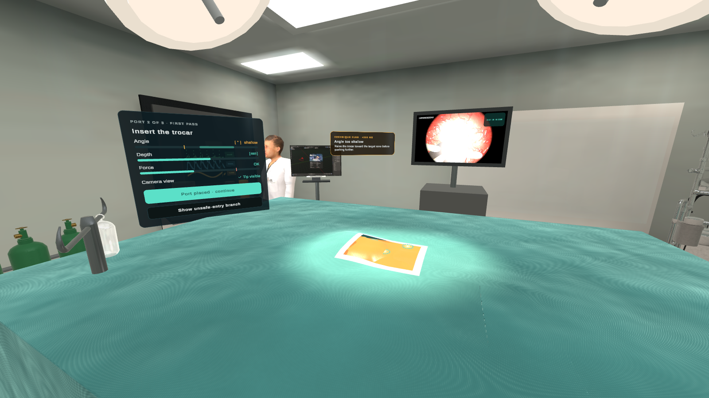
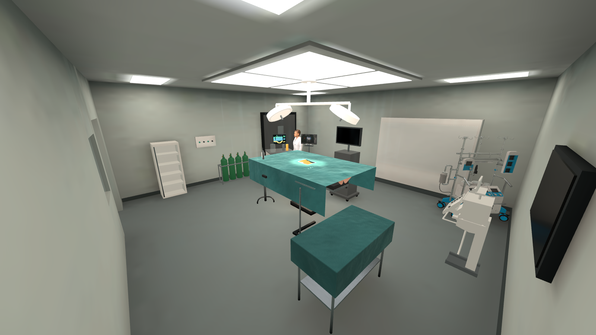
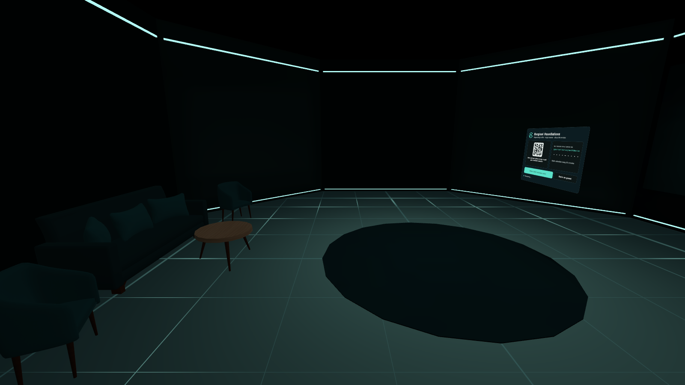
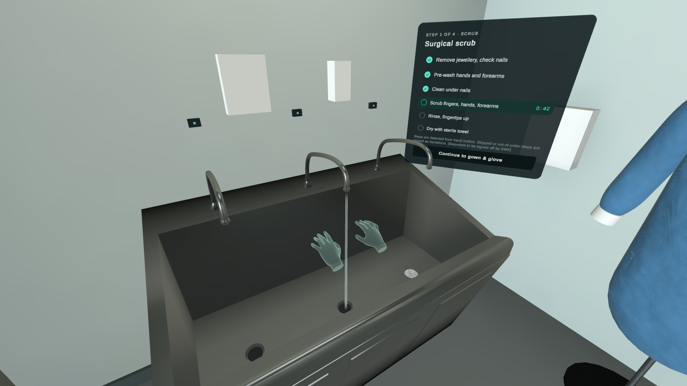
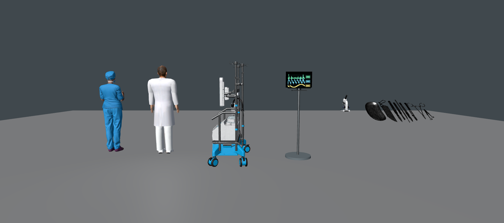
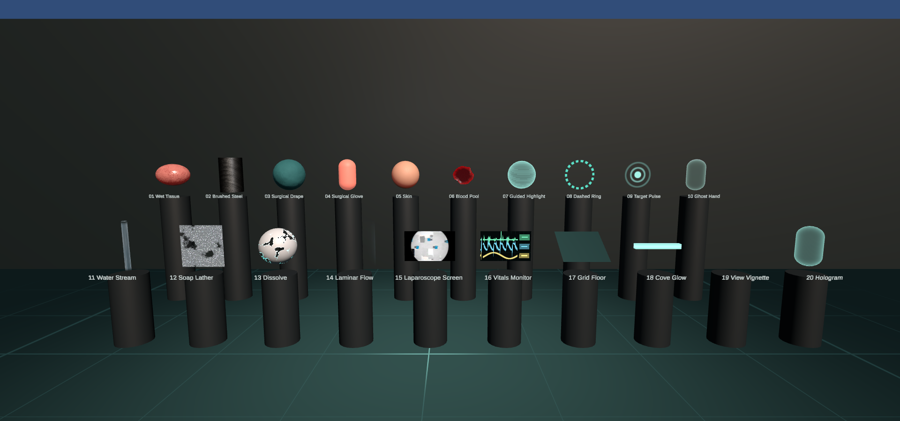

<div align="center">

# 🩺 Surgical Foundations VR

**A laparoscopic skills trainer for Meta Quest 3 — one learner, one theatre, about 15 minutes.**

Scrub in, gown and glove, place your ports, operate through a laparoscope and close — with real-time protocol feedback, on-device scoring and a full replay.




</div>

---

## Contents

- [What it is](#what-it-is)
- [The scenario](#the-scenario)
- [Screenshots](#screenshots)
- [Getting started](#getting-started)
- [Project structure](#project-structure)
- [How it's built](#how-its-built)
- [Content pipeline](#content-pipeline)
- [Performance budget](#performance-budget)
- [Roadmap](#roadmap)
- [Documentation](#documentation)
- [Credits](#credits)

---

## What it is

Surgical Foundations VR teaches the core steps of a laparoscopic procedure in a fully simulated operating theatre. Learners train in **Guided** mode (highlights, voice prompts, live protocol flags) or sit an **Assessment** (no cues, result sent to the LMS). Every action is logged as a protocol event — *on protocol*, *delayed* or *deviation* — and scored on the headset, so it works offline and syncs later.

| | |
|---|---|
| 🎯 **Audience** | Medical students and junior trainees |
| 🥽 **Hardware** | Meta Quest 3 (standalone), controllers or hand tracking |
| 🧭 **Modes** | Guided · Assessment · Seated or standing |
| 📊 **Output** | Session score, per-stage scores, top-3 issues, replay, xAPI / SCORM |

> **Current state:** a playable grey-box of the whole flow. All 41 asset-list models exist as real-scale placeholders (two already replaced by real rigged characters), all 16 UI screens are built from the design, lighting is baked, and the scenario runs end to end. Detection and scoring logic come next — see the [roadmap](#roadmap).

## The scenario

```
Lobby ──► Skills Lab (calibrate + tutorial)
  │
  └──► Operating Theatre
         ├─ 1 · Prep      scrub → sterility check → instrument count → drape
         ├─ 2 · Access    mark port sites → trocar entry  (⤷ vessel-injury branch)
         ├─ 3 · Operate   peg transfer → dissection → clip & cut, via the laparoscope
         ├─ 4 · Close     instrument & swab count → ports out under vision
         └─ Summary       score · stage bars · top 3 to work on · retry
```

Stages load **additively** on top of the theatre, so the room, lighting and patient never reload and scene changes are a fade, never a camera move (comfort, NFR-05).

## Screenshots

| Operating theatre (baked lighting) | Lobby (sign-in) |
|---|---|
|  |  |
| **Prep — ghost-hand scrub demo** | **Imported characters & equipment** |
|  |  |

<details>
<summary><b>All 16 UI screens</b> (rendered from the prefabs — click to expand)</summary>

| | | |
|---|---|---|
|  |  |  |
|  |  |  |
|  |  |  |

Regenerate any time with **Surgical Foundations ▸ Tools ▸ Render UI Previews** → `Docs/UI Previews/`.
</details>

<details>
<summary><b>Shader library</b> — 20 custom URP shaders</summary>



Wet tissue · brushed steel · surgical drape · glove contamination · skin · blood pool · guided highlight · dashed ring · target pulse · ghost hand · water stream · soap lather · dissolve · laminar flow · laparoscope screen · vitals monitor · grid floor · cove glow · view vignette · hologram. Details in [Docs/Shaders.md](Docs/Shaders.md).
</details>

## Getting started

### Requirements

- **Unity 6000.6.3f1** (Unity 6.6) with **Android Build Support** (OpenJDK, SDK & NDK)
- A **Meta Quest 3** with developer mode enabled — or just the editor with the XR Device Simulator
- No Git LFS needed — no single asset is larger than 20 MB

### Open and play

1. Clone the repository and open the folder in Unity Hub.
2. Open **`Assets/_Project/Scenes/Core/00_Bootstrap.unity`** and press **Play**.

> 💡 You can press Play in **any** project scene. `AppBootstrap` pulls in `00_Bootstrap` (XR rig, audio, services) automatically, and a stage scene also loads the theatre around it — handy for iterating on one stage.

### Controls

| Action | Quest controllers | Desk (editor) |
|---|---|---|
| Point & select UI | Ray + trigger | Mouse via XR Device Simulator |
| Grab instrument | Grip | — |
| Close jaws / fire clip | Trigger | — |
| Pause menu | Left **Menu** button | **Esc** |
| Move | Thumbstick / teleport | Simulator |

### Build to Quest

1. **File ▸ Build Profiles ▸ Android**, then *Switch Platform*.
2. The scene list is already set (the replay viewer is excluded — it's a separate desktop/WebGL build).
3. Connect the headset and **Build And Run**.

## Project structure

Everything we own lives in `Assets/_Project/`. Template and sample content stays where Unity put it.

```
Assets/_Project/
├── Art/           Materials · Models · Shaders (20) · Textures · VFX
├── Animation/     Characters · Hands · Instruments
├── Audio/         Ambience · SFX (UI, Feedback, Instruments, Environment) · Voice
├── Data/          SoundBank · UITheme · TMP icon sprites
├── Imports/       Third-party models as downloaded
├── Lighting/      LightingSettings · post-processing VolumeProfiles
├── Prefabs/       Environment · Equipment · Instruments · PPE · Anatomy · TrainingProps · Characters · UI
├── Scenes/        Core · Frontend · Theatre · Tools
├── Scripts/       Runtime (SurgicalFoundations.Runtime) · Editor (SurgicalFoundations.Editor)
└── UI/            Sprites · Icons · Fonts
```

| Scene | Loads | Contents |
|---|---|---|
| `00_Bootstrap` | Always | XR rig, session, scene loader, event log, audio, pause, subtitles |
| `01_Lobby` | Single | Sign-in, mode / posture / settings |
| `02_SkillsLab` | Single | Calibration, controller tutorial, peg board |
| `10_OR_Base` | Single, then host | Theatre, lighting, patient, equipment, HUD, summary |
| `11`–`14_Stage_*` | Additive | Prep · Access · Operate · Close content and UI |
| `90_ReplayViewer` | Separate build | Pose playback, learner / laparoscope / free cameras |
| `91_ShaderGallery` | Tools only | Every custom shader side by side |

Naming and the full folder guide: [Docs/ProjectStructure.md](Docs/ProjectStructure.md).

## How it's built

### Architecture

| System | Where | What it does |
|---|---|---|
| `SceneLoader` | Core | Fade → unload/load (single or additive) → place rig at spawn → fade in |
| `SessionManager` | Core | Settings, session clock, pause (time freezes, world dims) |
| `ScenarioDirector` | Scenario | Prep → Access → Operate → Close → Summary |
| `EventLogger` | Scenario | Protocol events with client UUIDs (idempotent sync), toasts, sounds |
| `StepSequence` | UI | Steps inside a stage, optional teleport per step, voice per step |
| `AudioManager` | Audio | Pooled 2D/3D sounds, categories, ambience ducking under voice, subtitles |
| `LaparoscopeFeed` | Lighting | Scope camera → RenderTexture → tower monitor, with power-on fade |


### Lighting

Rooms are fully **baked** (GPU lightmapper, area lights over the ceiling panels, AO, 3 bounces). The two surgical light heads are **mixed** spots, giving real-time highlights on steel and one soft shadow over the field. Dense light probes around the table light the moving instruments and hands; box-projected reflection probes give believable metal. Tone mapping is on for PC and off on Quest by default.

### UI

Built from the headset UI prototype: dark teal glass panels, mint accent `#5CE0C8`, coral `#FF8A79` for deviations, amber `#F5B54B` for warnings. World-space uGUI canvases at 1 px = 1 mm, with hover lift, sound and a controller haptic tick on every button.

### Audio

63 original placeholder sounds — synthesised UI, feedback, instrument and room sounds, seamless ambience loops, and text-to-speech voice prompts with subtitles. Replace any clip in place, keeping the file name.

## Content pipeline

**Swapping a placeholder for a real model:** every prefab is `Root` (colliders, grabbing, sounds, named pivots) → `Visual` (meshes only). Replace what's under `Visual`, keep the named transforms (`Pivot_Tip`, `Pivot_Port`, `Jaw_Upper`/`Jaw_Lower`, `CameraSocket`, …) and untick **Is Placeholder**. Imported rigged characters are fitted, turned to face +Z and posed out of the T-pose automatically.

## Performance budget

| Target | Budget |
|---|---|
| Frame rate | 72 fps on Quest 3 (NFR-01) |
| Scene load | < 15 s (NFR-03) |
| Visible triangles | ≈ 400k |
| Lightmaps | Non-directional, ≤ 1024² per room |
| Heavy effects | Laminar airflow and post-processing off on Quest by default |
