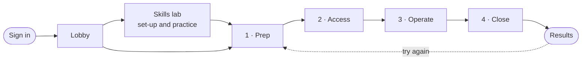

# Surgical Foundations VR

### Practise the first steps of keyhole surgery before you ever touch a patient.

A virtual-reality operating theatre for **Meta Quest 3** where medical students and junior surgical trainees
scrub in, prepare a sterile field, place their ports and operate through a laparoscope,
with a guide at their shoulder and honest feedback on every step.

Placing a port: live guidance on angle, depth and force, the laparoscope's view on the tower monitor, and the patient draped for surgery.

---

## Why this matters

**Keyhole (laparoscopic) surgery is one of the hardest skills a young surgeon learns.** The surgeon looks at a flat screen instead of into the body, works through long instruments that pivot at the skin, so the tip moves the *opposite* way to the hand, and feels far less of the tissue than with open surgery. Those skills take many hours of deliberate practice to build.

**Much of that practice still happens in the real operating theatre**, where time is scarce, the pressure is high and every mistake matters to a patient. Some of the most important lessons aren't about the instruments at all: a glove brushing a non-sterile edge, a forgotten swab, a port placed at the wrong angle. They are easy to make and costly to learn the hard way.

**Surgical Foundations VR gives learners somewhere safe to get those basics right first.** In the headset they can:

- **Repeat** a full procedure as often as they need, at any hour, without booking a theatre, a mentor or a simulator lab.
- **Build habits** of sterile technique and counting that protect patients, with a mistake shown the moment it happens.
- **Train the awkward hand-eye skills** of keyhole surgery: working through ports while watching a screen.
- **See their progress** in clear, consistent feedback, rather than depending on who happened to be supervising.

It doesn't replace supervised training in the real theatre. It helps learners arrive there better prepared, more confident and safer.

---

## Who it's for

| | |
|---|---|
| **Medical students** | A first, low-stress encounter with the theatre: how to scrub, gown, keep things sterile and what a laparoscopic operation looks like from the surgeon's position |
| **Junior surgical trainees** | Repeatable practice of port placement, instrument handling through the scope, and the counting and closing routine |
| **Educators** | A standard scenario every learner goes through the same way, with the same criteria, making it fairer to compare and easier to see where a group needs help |
| **Training programmes** | Practice on a standalone headset, designed to work without a network and to report results to the learning platform the institution already uses |

---

## The experience

One learner, one operating theatre, about fifteen minutes from sign-in to results.

| Step | What the learner does |
|---|---|
| **Sign in & lobby** | Signs in with a code from their phone, then chooses how to train: **Guided** (hints, voice prompts, live feedback) or **Assessment** (no help, just a result), standing or seated, controllers or bare hands. |
| **Skills lab** | Sets their height and the table height so the theatre fits their body, then practises the controls on a peg board. |
| **1 · Prep** | Scrubs at the sink while a demo shows the correct hand movements, gowns and gloves, checks the sterile back table, counts the instruments and drapes the patient. |
| **2 · Access** | Marks where the ports go on the abdomen and inserts them one by one, watching the entry angle, depth and force. |
| **3 · Operate** | Works through the laparoscope with a real camera view on the monitor: moving objects, dissecting and clipping. The guide calls out when an instrument drifts out of view. |
| **4 · Close** | Counts every instrument and swab (one is hidden on purpose) and removes the ports safely, camera port last. |
| **Results** | An overall score, a score per stage and the three things to work on next, with the option to repeat a stage or the whole scenario. |

A pause menu is always one button away, subtitles accompany every voice prompt, and every move between areas is a gentle fade, never a camera movement that could cause motion sickness.

### Feedback that teaches

Everything the learner does is checked against the surgical protocol and falls into one of three kinds:

- 🟢 **On protocol:** done correctly.
- 🟠 **Delayed:** right action, too late (for example, correcting a drifting instrument only after a prompt).
- 🔴 **Deviation:** something that would put a patient at risk (for example, a gloved hand touching a non-sterile surface). The edges of the view flash, a sound plays and the learner is told what went wrong and why.

In **Guided** mode this feedback appears in the moment, like a mentor at your shoulder. In **Assessment** mode it stays silent until the results, so the score reflects what the learner can do on their own.

---

## A look inside

| The operating theatre | The skills lab and ward |
|---|---|
|  |  |
| **Scrubbing in, with the correct technique demonstrated** | **The calm lobby where every session starts** |
|  |  |

The people and equipment of the simulation: scrub nurse, anaesthetist, the patient on the operating table, scrub sink, hospital bed, IV stand, oxygen, heart-lung machine, anaesthesia cart, monitors and furniture.

---

## What makes it different

- **A complete procedure, not a single drill.** Learners go from the scrub sink to closing, in the order it happens in real life, so habits connect into a routine.
- **A real laparoscope view.** A camera inside the patient's abdomen feeds the tower monitor, so learners practise watching the screen instead of their hands.
- **Designed around patient safety.** Sterility, counting and safe port placement are treated as seriously as the surgical skill itself.
- **Fair and consistent.** Every learner meets the same scenario and the same criteria, including a swab deliberately hidden before the final count.
- **Comfortable and accessible.** Standing or seated, adjustable to each learner's height, subtitles for every prompt, and no camera movement that causes motion sickness.
- **Built for real training programmes.** It targets a standalone headset that needs no PC, is designed to keep working offline, and is designed to report results in the standard formats (xAPI and SCORM) that learning platforms understand.

---

## Where the project is today

**A playable prototype of the whole experience.** A learner can walk through every step from sign-in to results in a lit, furnished operating theatre with a realistic patient, scrub sink, staff and equipment. All sixteen screens of the headset interface are built, and voice prompts and sound are in place.

**Connected to its server.** Learners sign in by scanning a QR code with their phone, or with a code from their learning platform, or train as a guest. The headset scores each run itself and shows the real result. It keeps every result safe while offline and uploads it when Wi-Fi returns; from there results reach the institution's learning platform (xAPI and SCORM). The lobby shows each learner's assignments and recent attempts. The server and the reasons behind its design are described in the [backend README](../Studium%20XR%20Backend/README.md).

**Coming next:**

- Recognising the learner's actions automatically (scrub movements, sterile contacts, port angle and depth, counts). Today learners move on with a *Continue* button.
- Recording sessions so learners and educators can replay them from any angle.
- A web dashboard where institutions and learners follow progress. The server side of this is already built.
- Later: realistic tissue that responds to instruments, bleeding complications, a virtual camera assistant and haptic feedback.

---

## Try it

**On a headset:** open the project in Unity 6 (6000.6.3f1) with Android support, connect a Meta Quest 3 and choose *Build And Run*.

**On a PC without a headset:** open the project in Unity and press **Play**. A built-in simulator lets you look around and use the virtual hands and controllers with the mouse and keyboard.

Setup details, controls and everything about how the project is built are in the **[Technical guide](Docs/TechnicalGuide.md)**.

---

## Credits

Created by the **Surgical Foundations team** (@DUSHIME), who designed the learning scenario, the headset interface and the production plan. Built with Unity, and with third-party 3D models listed in [Docs/ThirdPartyAssets.md](Docs/ThirdPartyAssets.md). Their sources and licences must be confirmed before any public release. Sounds, shaders and interface graphics were made for this project.

**Licence:** not yet chosen. All rights reserved by the project owners until a licence file is added.

---

Surgical Foundations VR is an educational tool. It is not a medical device and is not intended for clinical use or clinical decision-making.

